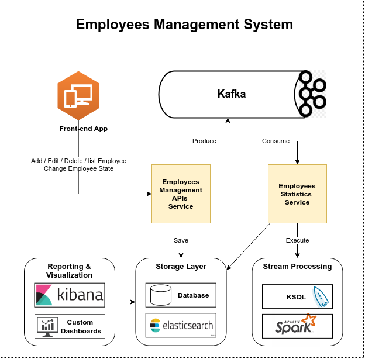
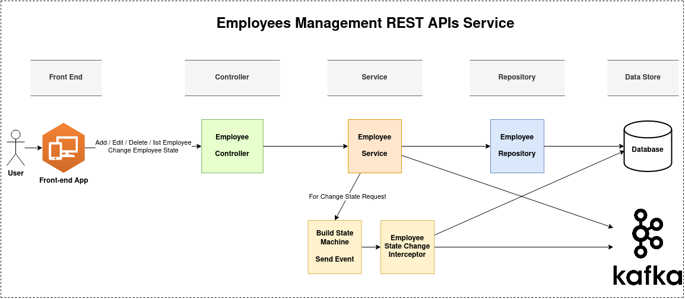
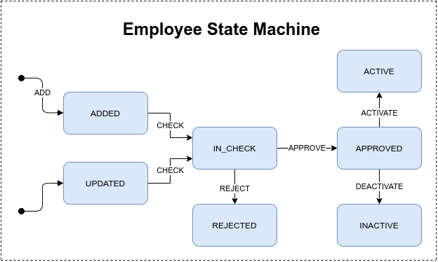
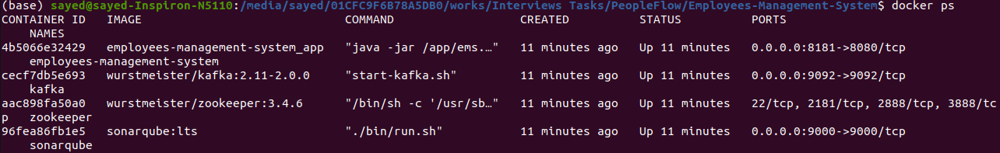

# Employees Management System EMS

A simple Employees Management System `EMS` provides Restful APIs for employees' operations with the ability to change the employees state defined in the state machine.

## Table of contents
* [Requirements](#requirements)
* [Architecture](#architecture)
* [Technologies](#technologies)
* [Getting Started](#getting-started)
* [Running the project using Docker and Docker Compose](#running-the-project-using-docker-and-docker-compose)
* [Running the project for Development using Maven](#running-the-project-for-development-using-maven)
* [About me](#about-me)
* [Acknowledgments](#acknowledgments)

## Requirements
Building an employees management system. The employees on this system are assigned to different states, Initially when an employee is added it will be assigned `ADDED` state automatically.

The other states (State machine) for A given Employee are:
- ADDED
- IN-CHECK
- APPROVED
- ACTIVE

## Architecture
The next diagrams shows the system architecture:



Employees Management System



Employees Management REST APIs Service

**The REST APIs Service follows the REST architectural style**:

 1. **Controller:** is the presentation layer where the end points are located.
 2. **Service:** is the service layer where the business logic resides.
 3. **Repository:** is the persistence layer where the CRUD repository is located.



Employee State Machine
 
## Technologies

The application is created using the following technologies:

1. Java 11
2. Spring Boot

	+ Web
	+ Data JPA
	+ State Machine
	+ security
	+ validation
	+ test
	+ Actuator

3. Maven Dependency Management
4. H2 In-Memory database
5. Kafka
6. Swagger 2
7. sonarqube
8. Docker

## Getting Started

### Running the project using Docker and Docker Compose
The project includes [*dockerfile*](dockerfile) file and [*docker-compose.yml*](docker-compose.yml) file, so you can use `Docker Compose` to start up the application with required softwares. No installation needed.

#### Prerequisites
You need to install:
* Docker 
* Docker-compose

#### Clone the project
Clone the project from `github` using the following `git` command at console:

```bash
git clone https://github.com/SayedBaladoh/Employees-Management-System.git
```

#### Run the project
- You can start the project using the below `docker-compose` command in the console at the project root directory:
 
```bash
cd Employees-Management-System/

docker-compose up
```

- Run without display logs:

```bash
docker-compose up -d
```

- In case of any changes, rebuild the image:

```bash
docker-compose up -d --build
```

- In the end, you can **verify** whether the project was started by running in the console:

```bash
docker ps
```

You should see the following running containers:




Kafka, Zookeper, Sonarqube and Employees Management System are UP and RUNNING

#### Access the EMS

EMS application will start on port `8181`, So you'll be able to access it under address `http://localhost:8181`.
	
- To view `details` about `EMS`: [http://localhost:8181/actuator/info](http://localhost:8181/actuator/info)
- For `Check Health`: [http://localhost:8181/actuator/health](http://localhost:8181/actuator/health)
- To access `Swagger` documentation to view the available Restful end-points, how to use and test APIs: [http://localhost:8181/swagger-ui.html](http://localhost:8181/swagger-ui.html)


### Running the project for Development using Maven

These instructions will get you a copy of the project up and running on your local machine for development and testing purposes. See deployment for notes on how to deploy the project on a live system.

#### Prerequisites

You need to install the following software

 * Java 11+

 * Maven 3.0+

#### Installing

Steps to Setup the project:

1. **Clone the application**

```bash
git clone https://github.com/SayedBaladoh/Employees-Management-System.git
```

2. **Create database schema**

	The schema will be generated automatically. 

3. **Change database username and password as per you want**

	The default database username is `sa` with empty `` password. If you want to change the database `username` and `password`:

	+ open `src/main/resources/application.properties` file.
	+ change `spring.datasource.username` and `spring.datasource.password` properties as per you want.

4. **Change server port as per you want**

	The server will start on port `8080` by default. If you want to change the default `port`:

	+ open `src/main/resources/application.yml` file.
	+ change `server:port:` property.
	
5. **Change kafka bootstrap servers**

	Change the kafka bootstrap servers to kafka url. You can use kafka defined at docker-compose.yml file as following:

	+ open `src/main/resources/application.yml` file.
	+ change `kafka bootstrap servers:` property.
	```
	kafka:
	  bootstrap:
	    servers: localhost:29092
	```
	
6. **Run the tests**

	You can run the automated tests by typing the following command:

	```bash
	mvn clean
	mvn test
	```
7.  **Generate Code coverage Analysis Report with Jacoco and Sonarqube**

	Type the following command on the command line with path to the root of this project:

	```bash
	mvn clean install sonar:sonar 
	```

	Wait until build process has finished.

	After getting a Build Success message, There are two link for you to open sonarqube on browser. click that link and automatically open your browser.
	
	Or go to localhost:9000 on the Web Browser and Click on the Project Name to see the detailed report.
	
8. **Run the EMS application**

	You can run the EMS spring boot app by typing the following command:

	```bash
	mvn spring-boot:run
	```

	The server will start on port `8080` by default, So you'll be able to access the complete application on `http://localhost:8080`. 
	If you changed the port in  `src/main/resources/application.properties` file, use your custom port `http://localhost:port`.

9. **Package the EMS application**

	You can also package the application in the form of a `jar` file and then run it like so -

	```bash
	mvn clean package
	java -jar target/ems-0.0.1-SNAPSHOT.jar

#### Access the EMS

To access the application use the following end-points:

- **Metrics to monitor the app**

	+ View availble metrics `http://localhost:8080/actuator/`

	+ View app info `http://localhost:8080/actuator/info`
	
	+ Health check `http://localhost:8080/actuator/health`

- **REST APIs Documentation: Swagger UI**

	Use Swagger to view and test the available Restful end-points.

	+ `http://localhost:8080/swagger-ui.html`


## About me

I am Sayed Baladoh - Phd. Senior / Technical Lead Software Engineer. I like software development. You can contact me via:

* [LinkedIn](https://www.linkedin.com/in/SayedBaladoh/)
* [Mail](mailto:sayedbaladoh@yahoo.com)
* [Phone +20 1004337924](tel:+201004337924)

_**Any improvement or comment about the project is always welcome! As well as others shared their code publicly I want to share mine! Thanks!**_

## Acknowledgments

Thanks for reading. Share it with someone you think it might be helpful.
